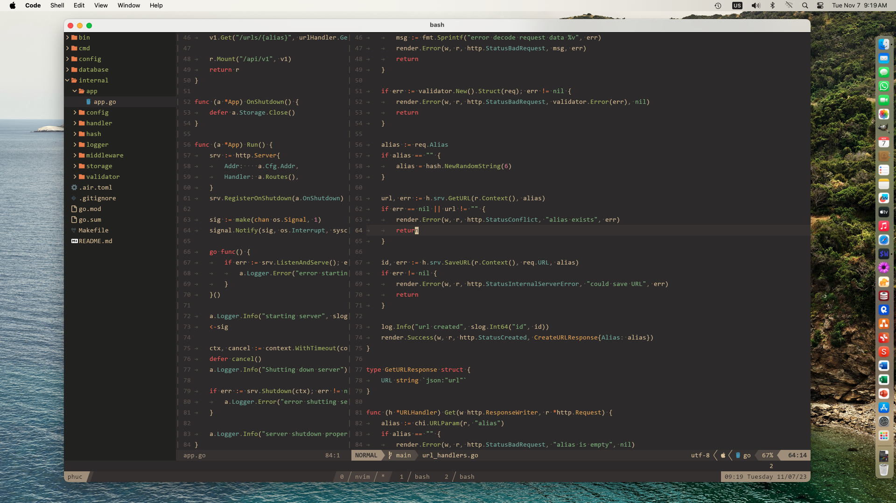

# Introduction

Render is a convenience Go package for dealing with Go HTTP request and response.



# Example

```go
package main

import (
	"log/slog"
	"net/http"


	"github.com/phucngodev/render"
)

type createExampleRequest struct {
	Name string `json:"name"`
}

type createExampleResponse struct {
	ID   string `json:"id"`
	Name string `json:"name"`
}

func exampleHandler(w http.ResponseWriter, r *http.Request) {
	var req createExampleRequest
	if err := render.DecodeJSON(r.Body, &req); err != nil {
		render.Error(w, r, http.StatusBadRequest, "bad request", err)
		return
	}

	render.Success(w, r, http.StatusCreated, createExampleResponse{ID: "1234", Name: req.Name})
}

func main() {
	http.HandleFunc("/example", exampleHandler)
	if err := http.ListenAndServe(":3000", nil); err != nil {
		log.Fatal(err)
	}
}
```

```bash
go run main.go

curl -X "POST" "http://localhost:3000/example" \
     -H 'Content-Type: application/json' \
     -d $'{ "name": "John" }'

```
